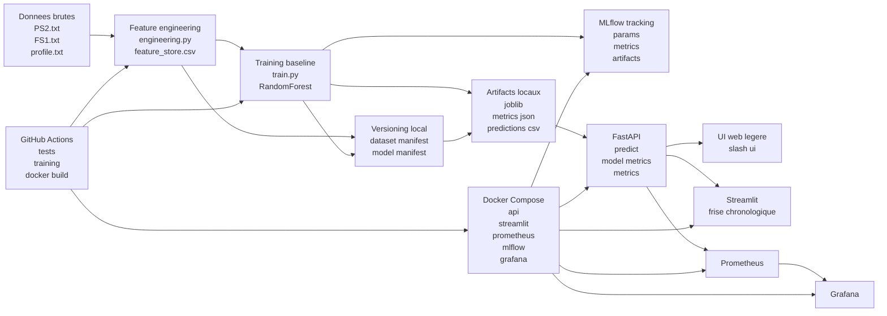

<div align="center" style="font-family: Garamond, Georgia, serif;">
  <h1>Pipeline MLOps de Maintenance Prédictive</h1>
  <p><strong>Prédiction de la condition de valve d'un système hydraulique industriel</strong></p>
  <p>Projet 2025-2026 orienté Data Science, industrialisation MLOps, observabilité et soutenance technique.</p>
</div>

Ce projet répond à un cas de maintenance prédictive: à partir des signaux `PS2`, `FS1` et `profile`, on construit un pipeline complet capable de préparer les données, entraîner un modèle, versionner les sorties, exposer une prédiction par API, visualiser les résultats et monitorer l'ensemble avec Prometheus, Grafana et MLflow.

## Pipeline MLOps de maintenance predictive

Le même diagramme est disponible dans [architecture.md](architecture.md) en version isolée et dans `assets/maintenance_mlops_architecture.svg` en version image.



## Positionnement du projet

1. Objectif métier: prédire si la condition de valve d'un cycle est optimale (`100 %`) ou non.
2. Contrainte imposée: les `2000` premiers cycles servent à l'apprentissage et les `205` derniers au test final.
3. Entrées autorisées: `PS2.txt`, `FS1.txt` et `profile.txt`.
4. Livrable visé: dépôt Git, tests, Docker, application web, versioning, CI/CD, monitoring et support d'explication.

## Ce que contient le dépôt

```text
.
|-- .github/workflows/ci.yml
|-- assets/
|-- artifacts/
|-- dashboard/
|-- data/
|-- frontend/
|-- monitoring/
|-- ressources/
|-- scripts/
|-- src/maintenance_preventive/
|-- tests/
|-- architecture.md
|-- docker-compose.yml
|-- Dockerfile
|-- LICENSE
|-- pyproject.toml
|-- requirements.txt
`-- README.md
```

## Livrables couverts

| Exigence | Réponse actuelle | Preuve dans le dépôt |
|---|---|---|
| Code du projet sur GitHub ou GitLab | Dépôt prêt à publier | Structure complète du repo |
| Tests unitaires | Oui | `tests/` + `pytest` |
| Containerisation | Oui | `Dockerfile` + `docker-compose.yml` |
| Application web de prédiction | Oui | `frontend/` + `dashboard/` + API FastAPI |
| Versioning du modèle et du dataset | Oui, version locale légère | `artifacts/metadata/dataset_version.json`, `artifacts/metadata/model_version.json`, MLflow |
| Système de déploiement via CI/CD | CI prête, CD à renforcer | `.github/workflows/ci.yml` |
| Monitoring | Oui | `monitoring/`, Prometheus, Grafana |
| Support de restitution | Oui | `README.md` + `architecture.md` |

## Résultats actuels du baseline

Les métriques sont produites dans `artifacts/metrics/baseline_metrics.json`.

| Métrique | Valeur |
|---|---|
| Accuracy | `0.8488` |
| Precision | `0.7019` |
| Recall | `1.0000` |
| F1 | `0.8249` |
| ROC AUC | `0.9975` |

Lecture rapide:
1. Le rappel à `1.0` montre qu'aucun cycle non optimal n'est manqué dans le test final.
2. La précision plus basse indique qu'il reste des faux positifs.
3. Le ROC AUC très élevé confirme une bonne séparation globale des classes.

## Démarrage local

1. Créer l'environnement et installer les dépendances.

```powershell
powershell -ExecutionPolicy Bypass -File .\scripts\setup-venv.ps1
```

2. Construire le feature store.

```powershell
powershell -ExecutionPolicy Bypass -File .\scripts\build-features.ps1
```

3. Entraîner le modèle baseline et produire les manifests de versioning.

```powershell
powershell -ExecutionPolicy Bypass -File .\scripts\train-model.ps1
```

4. Lancer l'API locale.

```powershell
powershell -ExecutionPolicy Bypass -File .\scripts\run-api.ps1
```

5. Lancer MLflow.

```powershell
powershell -ExecutionPolicy Bypass -File .\scripts\run-mlflow.ps1
```

6. Lancer Streamlit si besoin.

```powershell
powershell -ExecutionPolicy Bypass -File .\scripts\run-dashboard.ps1
```

7. Exécuter les tests.

```powershell
.\.venv\Scripts\Activate.ps1
pytest
```

## Adresses utiles

Les interfaces ne s'ouvrent pas automatiquement.

### Local

| Service | Adresse |
|---|---|
| API FastAPI | `http://127.0.0.1:8010/docs` |
| UI web légère | `http://127.0.0.1:8010/ui` |
| MLflow | `http://127.0.0.1:5000` |

### Docker

| Service | Adresse |
|---|---|
| API FastAPI | `http://127.0.0.1:8011/docs` |
| UI web légère | `http://127.0.0.1:8011/ui` |
| Streamlit | `http://127.0.0.1:8501` |
| Prometheus | `http://127.0.0.1:9090` |
| MLflow | `http://127.0.0.1:5000` |
| Grafana | `http://127.0.0.1:3000` |

Crédentiels de démonstration Grafana:
1. Utilisateur: `admin`
2. Mot de passe: `admin`

## Stack Docker complète

Lancement:

```powershell
powershell -ExecutionPolicy Bypass -File .\scripts\start-mlops-stack.ps1
```

Arrêt:

```powershell
powershell -ExecutionPolicy Bypass -File .\scripts\stop-mlops-stack.ps1
```

Les conteneurs ont des noms explicites pour éviter les suffixes automatiques de type `-1`:
1. `maintenance_preventive_api`
2. `maintenance_preventive_streamlit`
3. `maintenance_preventive_prometheus`
4. `maintenance_preventive_mlflow`
5. `maintenance_preventive_grafana`

## Versioning du dataset et du modèle

Le projet ne se limite plus à un simple export de fichiers.

1. Le feature store déclenche la création de `artifacts/metadata/dataset_version.json`.
2. L'entraînement déclenche la création de `artifacts/metadata/model_version.json`.
3. MLflow conserve les paramètres, métriques et artefacts de chaque run.
4. Les fichiers versionnés localement contiennent les empreintes `sha256`, tailles, chemins et résumés de métriques.

Cette approche répond à l'exigence de reproductibilité sans alourdir le projet avec une stack de registry plus complexe.

## Application web fonctionnelle

Deux interfaces sont disponibles:

1. Une UI web légère servie par FastAPI sur `/ui`.
2. Un dashboard Streamlit orienté démonstration sur `:8501`.

Le dashboard Streamlit présente maintenant une lecture chronologique des cycles:
1. courbe de l'efficacité réelle de la valve;
2. courbe de probabilité prédite;
3. fenêtre temporelle sélectionnable;
4. focus sur un cycle particulier.

## CI/CD actuel

Le workflow GitHub Actions actuel:
1. installe Python `3.10`;
2. installe les dépendances;
3. reconstruit le feature store;
4. entraîne le baseline;
5. lance `pytest`;
6. archive les artefacts utiles;
7. valide `docker build`;
8. valide `docker compose config`.

Ce pipeline est déjà une bonne CI de projet MLOps, car il rejoue les étapes critiques du projet de bout en bout.

## Comment améliorer le CI/CD

La partie CI est déjà solide, mais la partie CD peut être renforcée.

1. Publier automatiquement l'image Docker dans GHCR sur `main` ou sur tag.
2. Ajouter un job de smoke test qui démarre la stack et teste `/health`, `/ui` et `/metrics`.
3. Déployer automatiquement sur une cible de démonstration après validation, par exemple Render, Railway, Azure Container Apps ou un VPS.
4. Ajouter une stratégie de versionnement sémantique des releases.
5. Gérer les secrets via GitHub Actions Secrets plutôt que des valeurs de démo dès qu'un vrai environnement existe.
6. Ajouter un contrôle de qualité supplémentaire: linting, sécurité des dépendances et tests API.

En l'état, on peut parler honnêtement de `CI prête` et de `CD amorcé mais améliorable`.

## Ce qui part sur GitHub et ce qui reste local

### Embarqué dans le dépôt

1. Le code source `src/`.
2. Les scripts `scripts/`.
3. Les tests `tests/`.
4. Les dashboards et le monitoring `dashboard/`, `frontend/`, `monitoring/`.
5. La CI `.github/workflows/ci.yml`.
6. Le `README`, `architecture.md`, `Dockerfile`, `docker-compose.yml`, `LICENSE`.
7. Les squelettes légers de `data/`, `artifacts/` et `ressources/`.

### Conservé en local

1. `.venv/`, `.vscode/`, `.pytest_cache/`.
2. Les données brutes réellement embarquées.
3. Les artefacts générés au fil des exécutions.
4. Les exports MLflow lourds.
5. Le PDF de consigne et les archives source si vous décidez de ne pas les publier.

## Limites actuelles

1. Le modèle est un baseline RandomForest, pas encore un benchmark multi-modèles.
2. Le CD n'effectue pas encore un déploiement automatique sur un environnement distant.
3. Le versioning est local et léger, pas encore outillé via DVC ou registry complet.
4. Les métriques de dérive ou de qualité de données en production peuvent encore être enrichies.

## Sources, crédentiels et réutilisabilité

### Dataset utilisé

1. Source: UCI Machine Learning Repository, *Condition Monitoring of Hydraulic Systems*.
2. URL: `https://archive.ics.uci.edu/dataset/447/condition+monitoring+of+hydraulic+systems`
3. DOI: `10.24432/C5CW21`
4. Licence du dataset: `CC BY 4.0`

### Crédentiels

1. Grafana de démonstration: `admin / admin`
2. Aucun secret de production n'est embarqué dans ce dépôt.

### Réutilisabilité et licence

1. Le code de ce projet est distribué sous licence `MIT`, voir [LICENSE](LICENSE).
2. Le dataset conserve sa licence propre `CC BY 4.0` et ne change pas de licence parce qu'il est utilisé ici.
3. Pour republier le projet, il faut citer la source UCI et respecter la licence du dataset.
