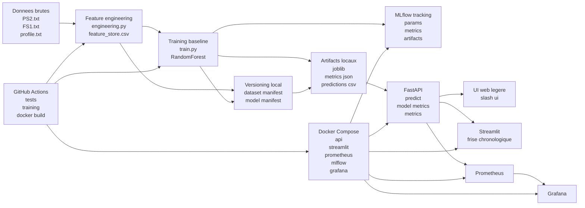

# Pipeline MLOps de maintenance predictive

```mermaid
flowchart LR
    A[Donnees brutes<br/>PS2.txt<br/>FS1.txt<br/>profile.txt]
    B[Feature engineering<br/>engineering.py<br/>feature_store.csv]
    C[Training baseline<br/>train.py<br/>RandomForest]
    D[Versioning local<br/>dataset manifest<br/>model manifest]
    E[Artifacts locaux<br/>joblib<br/>metrics json<br/>predictions csv]
    F[MLflow tracking<br/>params<br/>metrics<br/>artifacts]
    G[FastAPI<br/>predict<br/>model metrics<br/>metrics]
    H[UI web legere<br/>slash ui]
    I[Streamlit<br/>frise chronologique]
    J[Prometheus]
    K[Grafana]
    L[GitHub Actions<br/>tests<br/>training<br/>docker build]
    M[Docker Compose<br/>api<br/>streamlit<br/>prometheus<br/>mlflow<br/>grafana]

    A --> B
    B --> C
    B --> D
    C --> D
    C --> E
    C --> F
    D --> E
    E --> G
    G --> H
    G --> I
    G --> J
    J --> K
    L --> B
    L --> C
    L --> M
    M --> G
    M --> F
    M --> I
    M --> J
    M --> K
```
